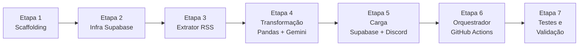

# 🎯 Plano de Execução — Concurseiro CE Pro

Projeto de ecossistema de dados automatizado para monitorar editais de concursos públicos no Ceará. O foco inicial é o **Módulo 1: Radar de Editais**, um pipeline ETL serverless orquestrado por GitHub Actions.

---

## 🗺️ Visão Geral das Etapas



---

## Etapa 1 — Scaffolding e Configuração do Projeto

**Objetivo:** Criar a estrutura de diretórios, arquivos base e dependências do projeto.

### Entregas
- Criar toda a estrutura de pastas conforme o README (src/extractors, src/transformers, etc.)
- Criar `requirements.txt` com as dependências:
  ```
  pandas
  requests
  feedparser
  google-generativeai
  supabase
  python-dotenv
  tenacity
  ```
- Criar `.env.example` com as variáveis de ambiente necessárias:
  ```
  SUPABASE_URL=
  SUPABASE_KEY=
  GEMINI_API_KEY=
  DISCORD_WEBHOOK_URL=
  ```
- Criar todos os `__init__.py`
- Criar `src/utils/logger_config.py` — logger padronizado para GitHub Actions
- Criar `src/utils/hash_generator.py` — gerador de hash MD5 para idempotência

---

## Etapa 2 — Infraestrutura do Supabase (Banco de Dados)

**Objetivo:** Provisionar o banco PostgreSQL no Supabase com as tabelas necessárias.

### Entregas
- Executar a migration SQL no painel do Supabase (SQL Editor):
  - Tabela `radar_editais` com o schema definido no README
  - Index `idx_radar_hash` na coluna `hash_identificador`
- Criar `src/loaders/supabase_client.py`:
  - Classe/funções para conectar ao Supabase via `supabase-py`
  - Função `hash_ja_existe(hash: str) -> bool` — verifica idempotência
  - Função `inserir_edital(dados: dict) -> None` — insere novo edital
  - Função `marcar_como_notificado(hash: str) -> None` — atualiza flag Discord

> [!IMPORTANT]
> As credenciais do Supabase **jamais** devem ser hardcodadas. Use `os.getenv()` em todos os pontos de acesso.

---

## Etapa 3 — Extrator RSS (Camada E do ETL)

**Objetivo:** Implementar a busca de editais no feed do PCI Concursos filtrando pelo Ceará.

### Entregas
- Criar `src/extractors/rss_concursos.py`:
  - Buscar o feed de concursos: `https://www.pciconcursos.com.br/concursos/#CE`
  - Utilizar `feedparser` para parsear o RSS/HTML
  - Implementar **resiliência** com `tenacity` (retry + backoff exponencial) e `timeout`
  - Filtrar itens pelo estado **CE** ou palavras-chave (Ceará, Fortaleza, etc.)
  - Retornar lista de dicionários com: `{ titulo, link, banca, data_publicacao }`

> [!NOTE]
> A URL do PCI Concursos pode não ter um feed RSS nativo. Pode ser necessário fazer scraping do HTML com `requests` + `BeautifulSoup` como fallback. Verificar e adaptar na implementação.

---

## Etapa 4 — Transformação: Pandas + Gemini (Camada T do ETL)

**Objetivo:** Limpar os dados extraídos e enriquecer com IA (sumarização e extração de entidades).

### Entregas

#### 4a. `src/transformers/filtros_pandas.py`
- Receber a lista de editais como `pd.DataFrame`
- Remover duplicatas locais (antes de consultar o banco)
- Normalizar campos (datas, texto, URLs)
- Gerar o `hash_identificador` (MD5 da URL ou título) usando `hash_generator.py`

#### 4b. `src/transformers/gemini_nlp.py`
- Utilizar a API `google-generativeai` (Gemini Flash — mais econômico)
- Prompt estruturado para cada edital, solicitando retorno em **JSON** com:
  ```json
  {
    "orgao_banca": "...",
    "cargo_principal": "...",
    "remuneracao_maxima": 0.00,
    "data_prova": "YYYY-MM-DD",
    "resumo": "..."
  }
  ```
- Tratar falhas de parsing JSON com fallback gracioso (salvar sem dados de IA)

---

## Etapa 5 — Carga: Supabase + Discord (Camada L do ETL)

**Objetivo:** Persistir os novos editais e disparar notificações no Discord.

### Entregas

#### 5a. `src/loaders/supabase_client.py` (completar)
- Verificar `hash_identificador` antes de inserir (idempotência)
- Inserir apenas registros **novos** na tabela `radar_editais`

#### 5b. `src/loaders/discord_notifier.py`
- Enviar webhook para o Discord com embed formatado contendo:
  - 📋 **Banca/Órgão**
  - 💼 **Cargo Principal**
  - 💰 **Remuneração Máxima**
  - 📅 **Data da Prova**
  - 🔗 **Link do Edital**
  - 📝 **Resumo da IA**
- Após notificação bem-sucedida, chamar `marcar_como_notificado(hash)`

---

## Etapa 6 — Orquestrador: `main.py` + GitHub Actions

**Objetivo:** Conectar todas as camadas ETL e agendar a execução automática.

### Entregas

#### 6a. `main.py`
```python
# Fluxo orquestrado:
# 1. Extrair → rss_concursos.extrair()
# 2. Transformar → filtros_pandas.processar() + gemini_nlp.enriquecer()
# 3. Carregar → supabase_client.inserir() + discord_notifier.notificar()
```

#### 6b. `.github/workflows/pipeline_diario.yml`
- Trigger: `schedule` com CRON (ex: `0 8 * * *` — todo dia às 08:00 UTC)
- Trigger manual: `workflow_dispatch` (para testes)
- Configurar **GitHub Secrets** para todas as variáveis de ambiente
- Steps:
  1. `actions/checkout`
  2. `actions/setup-python@v4` (Python 3.10+)
  3. `pip install -r requirements.txt`
  4. `python main.py`

> [!IMPORTANT]
> Configurar os **GitHub Secrets** no repositório antes de ativar o workflow:
> `SUPABASE_URL`, `SUPABASE_KEY`, `GEMINI_API_KEY`, `DISCORD_WEBHOOK_URL`

---

## Etapa 7 — Testes e Validação

**Objetivo:** Verificar que o pipeline funciona de ponta a ponta.

### Checklist de Validação

| Teste | Como Verificar |
|-------|---------------|
| Extrator retorna dados | Rodar `python -c "from src.extractors.rss_concursos import extrair; print(extrair())"` |
| Hash é gerado corretamente | Verificar que hashes são MD5 de 32 chars |
| Idempotência funciona | Rodar o pipeline 2x e confirmar que Discord recebe apenas 1 notificação |
| Gemini retorna JSON válido | Verificar logs com a resposta bruta da API |
| Supabase recebe os dados | Conferir tabela `radar_editais` no painel do Supabase |
| Discord recebe o embed | Verificar canal Discord configurado |
| GitHub Actions executa | Disparar manualmente via `workflow_dispatch` e verificar logs |

---

## 📋 Sequência de Implementação Resumida

- [ ] **Etapa 1** — Scaffolding + utils (logger, hash)
- [ ] **Etapa 2** — Migration SQL no Supabase + `supabase_client.py`
- [ ] **Etapa 3** — `rss_concursos.py` com resiliência
- [ ] **Etapa 4a** — `filtros_pandas.py`
- [ ] **Etapa 4b** — `gemini_nlp.py`
- [ ] **Etapa 5** — `discord_notifier.py` + completar loader
- [ ] **Etapa 6** — `main.py` + workflow `.yml`
- [ ] **Etapa 7** — Validação end-to-end

---

> [!NOTE]
> O **Módulo 2 (Vigilante de Diários Oficiais)** está fora do escopo desta fase. Ele utilizará a tabela `vigilante_dou` já criada na migration e seguirá a mesma arquitetura ETL, mas com `src/extractors/api_gov.py` como fonte de dados.
